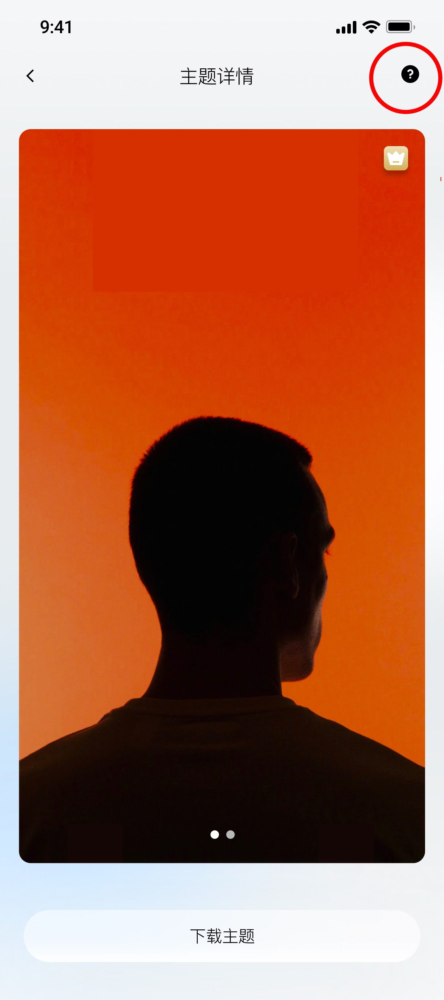
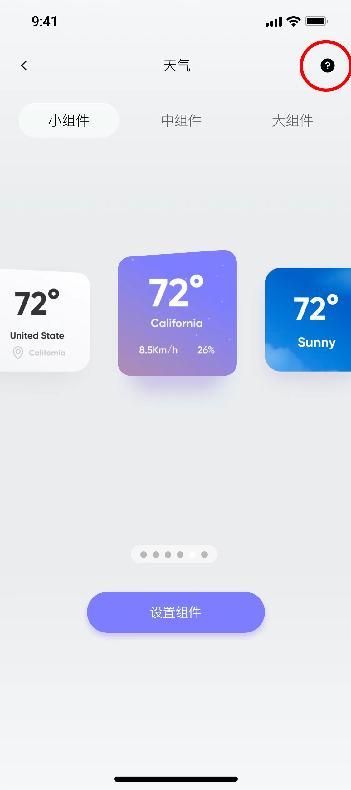
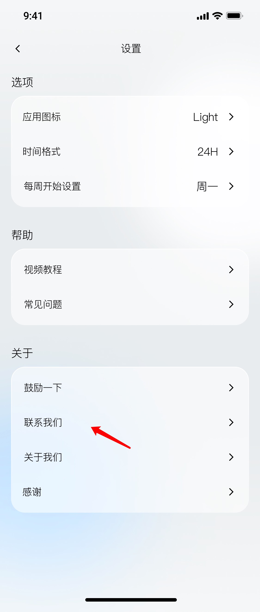
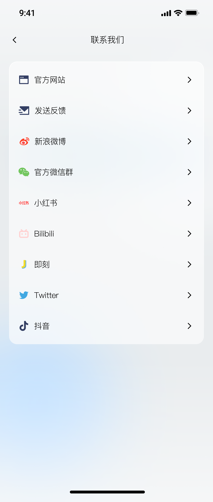

# 其他

### 我不知道如何开始使用OneWidget？
感谢您在众多应用中使用 OneWidget，你可以在帮助中心里观看完整的视频教程，也可以在“主题”和“小组件”页面的右上角点击“？”展开具体的教程。

### "这里找不到我想问的！" 或"我有话要对 Onewidget 说！"
我们提供多种联系渠道，请点击“联系我们”随时与我们联系！ 我们会尽最大努力尽快为您提供帮助。

   
### 为什么付费后还不是VIP？
请先查看是否扣款成功，如果已经扣款成功，但还不是会员，可以从VIP会员页进入，点击【恢复购买】按钮，恢复会员。

### 为什么购买会员失败？
网络延迟导致该问题出现，如已成功扣款可以点击恢复购买按钮；如扣款后24小时后还未显示解锁高级版并不能恢复购买，请及时去AppStore退款或取消订阅。

### 购买高级版后，换手机需要再次购买吗？
新手机使用的苹果ID和之前购买高级版使用的苹果ID是同一ID，就可以通过点击恢复购买，解锁高级版。

### 为什么打开APP是英文版的？
打开【设置】，搜索OneWidget，设置【首选语言】，修改为简体中文即可。