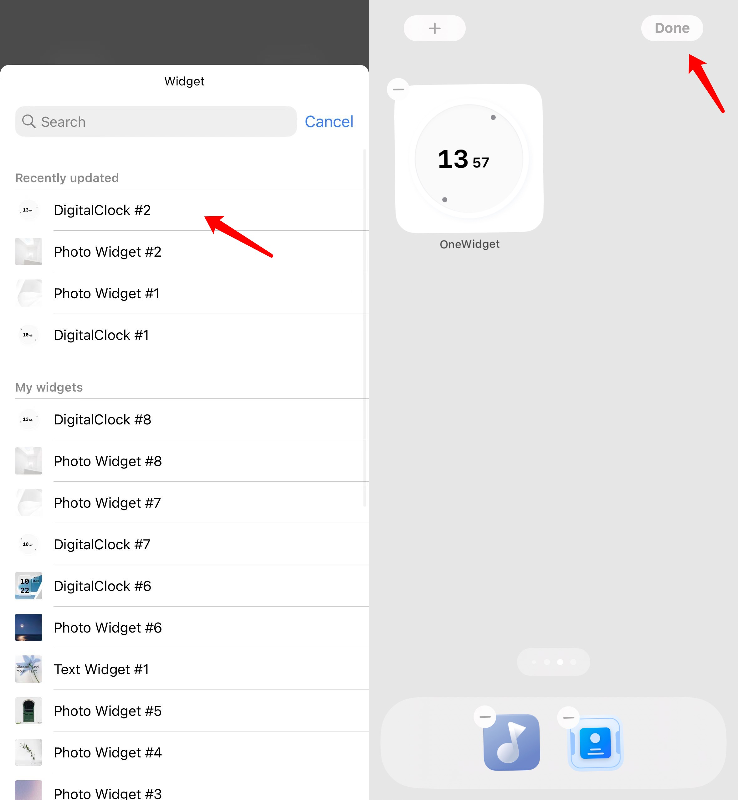
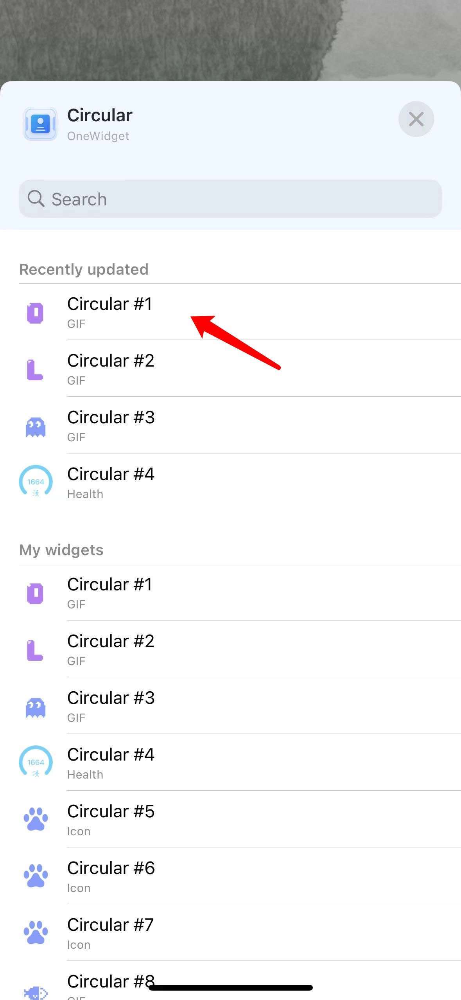
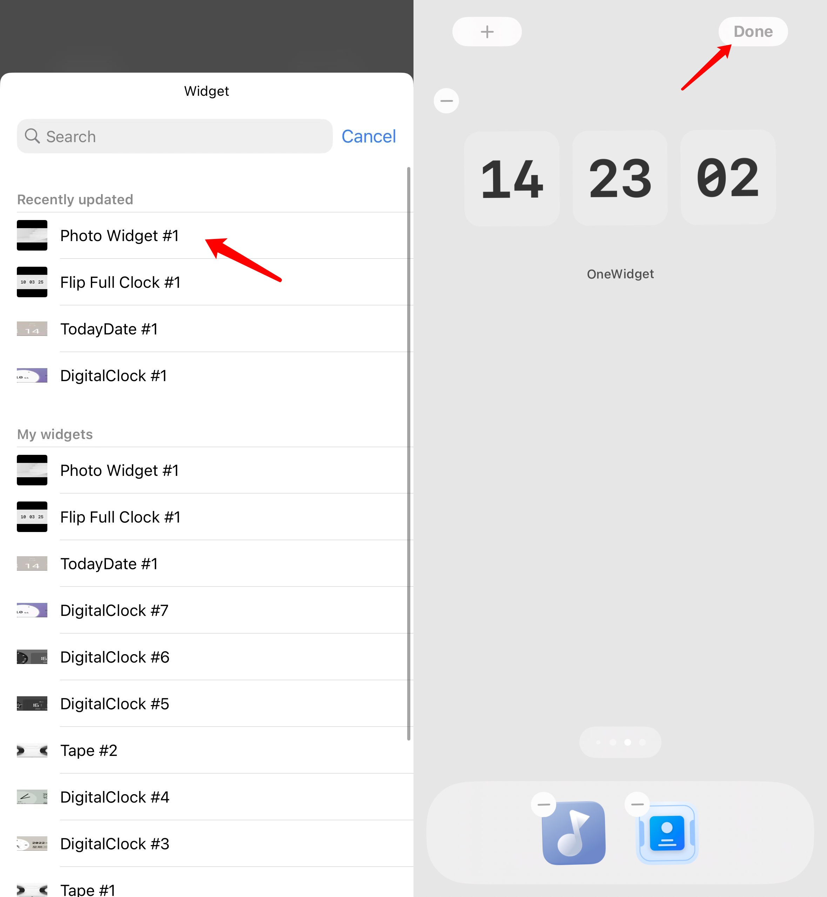

# Tutorial

## Home Screen Widget

1. Select the widget you like and click "Add widget".

2. You can customize the foyegorund color and the background, then click "Save widget" .

3. Go back to the desktop, press the blank space on the desktop for a long time, and click the "+" sign in the upper left corner.

4. Find "OneWidget" and click on it.

5. Select the size of the widget you just saved, click on "Add widget".

6. Click the widget again to enter the configuration list, click "Select".

7. Click to select the widget you just saved, and click "Finish" in the upper right corner to add it successfully.

## Lock Screen Widget

1. Select your favorite lock screen widget, customize it, and click "Save widget".

2. Click "To App  Setting" to jump to the "Wallpaper" page

3. Click "Customize", jump to the lock screen edit page, then click the area below the time

4. Find "OneWidget" and click on it

5. Select the size of the lock screen widget you just saved

6. Click the widget again to enter the configuration list

7. Click to select the lock screen widget you just saved

8. Close the configuration list and click "Finish" in the upper right corner to add it successfully.

## Transparent Widget

1. Long press the desktop margin, enter edit desktop mode, slide left to a page without icons, take a screenshot.

2. Open Settings, select Display and Brightness, set to dark mode.

3. Follow step 1 and take another screenshot of the blank desktop.

4. Open OneWidget, go to "Mine - Transparent ". 

5. Upload the corresponding screenshot according to the dark/light color mode.

6. Select the widget that needs transparent effect, click "Transparent Background", and set the location of the widget.

7. Save the widget, the transparent effect is set successfully.

8. Return to the desktop, press the blank space on the desktop for a long time, click the "+" sign in the upper left corner.

9. Find "OneWidget" and click on it.

10. Select the size of the widget you just saved, click on "Add widget".

11. Click the widget again to enter the configuration list, and click "Choose".

12. Click to select the transparent widget you just saved, and click "Finish" in the upper right corner to add it successfully.

## iOS Theme

1. Select the theme you want, click "Use"

2. Check the wallpaper image and component background image you like, click "Next"

3. Check the App icon you want to replace, click "Install"

4. Jump to the download description file prompt page, click "Allow"

5. Close the prompt and return to desktop

6. Open "Settings - Wallpaper", add new wallpaper, set the wallpaper you just saved as the lock screen wallpaper and home screen wallpaper respectively

7. Return to OneWidget, click "Open app settings", and jump to the description file settings page

8. Click the icon set you just downloaded, click "Install", enter the password and install it, then click Finish.

9. Return to OneWidget, set the corresponding widget according to the theme style, and add it to the desktop

10. Refer to the theme style, layout the desktop layout, the settings are complete

## Wallpapers

1. Select the wallpaper you like, click "Download". 

2. Open "Settings-Wallpaper", click "Add new wallpaper", and set the wallpaper you just saved as the lock screen wallpaper or home screen wallpaper

## Live Activity (Dynamic Island)

1. Open OneWidget ， go to " Mine - Dynamic Island ".

2. Select the content you want, click "Start".

